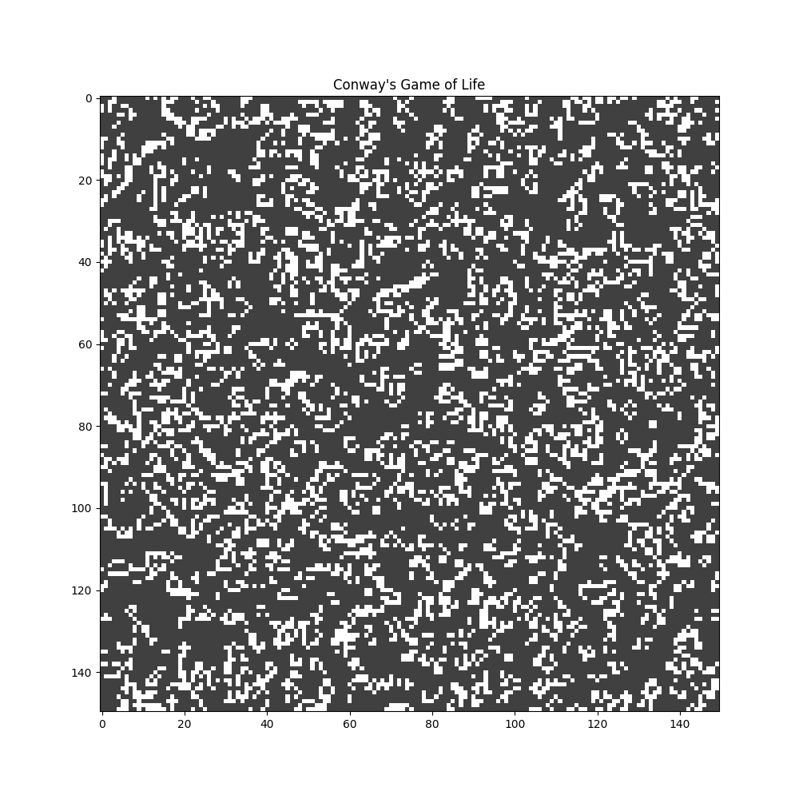
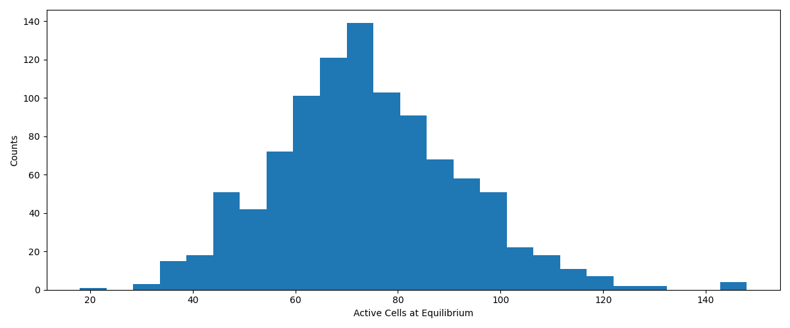
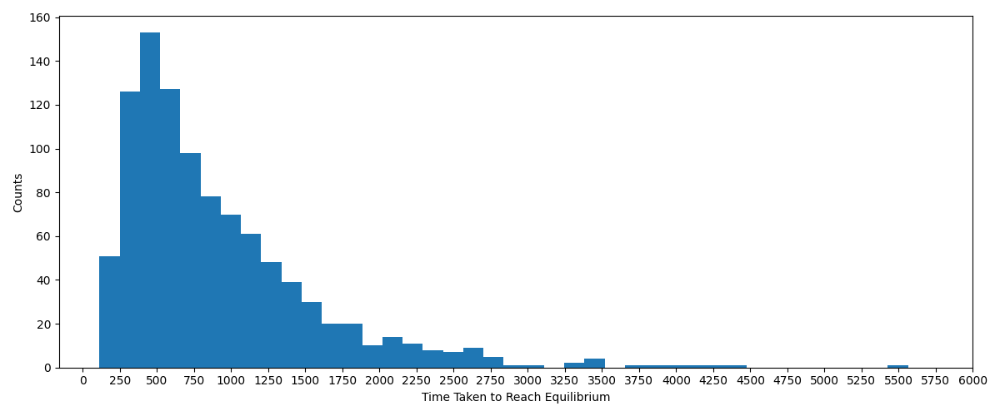

# Conway's Game of Life
Simulates Conway's game of life on a given N x N lattice, with a given initial state or an arbitrary random one.


## Installation
Download the GoL.py file and import the Conway class.
```python
from GoL import Conway
```

## Usage
Create a Conway object first, and specify the size of the lattice. In this case without specifying a lattice, the game of life is initialized with a random state.
```python
size = 100
gol = Conway(size)
```
If we want a specific initial state, then we make an ndarray to represent the lattice and pass it as an argument of Conway. For example in the case of a simple glider:
```python
size = 100
g = np.array(([0, 1, 0], [0, 0, 1], [1, 1, 1]))
glider = np.zeros((size, size))
glider[int(size/2)-1:int(size/2)+2, int(size/2)-1:int(size/2)+2] = g
gol = Conway(size, glider)
```
To run a simulation, run the game_of_life() method with a specified fps. This will animate the game of life on matplotlib.
```python
fps = 50
gol.game_of_life(50)
```

## Measurement of active sites at equilibrium
The measurement() method generates random initial states and simulates the game of life until equilibrium has been reached. This is defined as the number of active sites stop changing, however final states whose number of active states oscillate with a fixed period are also considered as equilibrium. The method automatically detects when equilibrium is reached, and subsequently records the number of active sites and time taken to reach equilibrium. The times and active sites are outputted as .csv files for further data analysis as required.
```python
gol.measurement()
```
The method also has a function to save final states with oscillation periods larger than 2 so that the user may check them out if they are curious. 

## Example measurement for 50 x 50 lattice



## Centre-of-mass velocity
The GoL.py file has a function that takes in an arbitrary glider as an ndarray, simulates the game of life using it and measures the centre-of-mass velocity of the glider.
```python
# defining the glider
g = np.array(([0, 1, 0], [0, 0, 1], [1, 1, 1]))
glider = np.zeros((size, size))
glider[int(size/2)-1:int(size/2)+2, int(size/2)-1:int(size/2)+2] = g

# measuring com velocity
cm_glider(size, glider)
```
Output:
```
Velocity: [-0.25 -0.25]
Speed: 0.35355339059327484
This would be correct in a continuous space, but the game of life runs on a discrete lattice.
This means the norm of the velocity isn't actually the speed of the glider.
```

